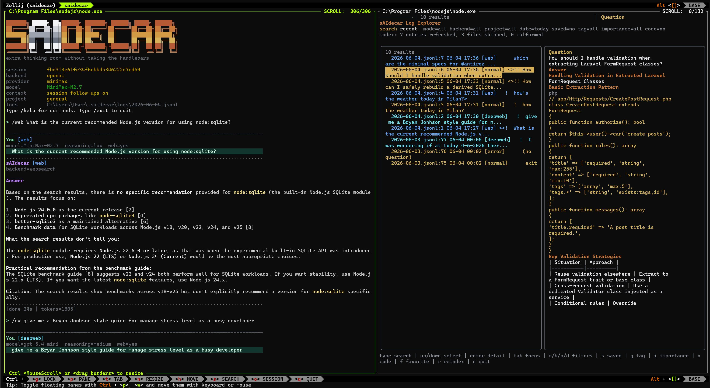

# sAIdecar

sAIdecar is a small terminal AI tool I built for my own daily workflow

I wanted a fast scratchpad for the questions that come up while I am working but do not always belong in my main coding agent or flagship LLM session

During the day I often need to ask small project-related questions, clarify an idea, compare options, draft a note, check syntax or park an answer for later

I wanted that flow to be quick, local and separate from the larger AI sessions that are focused on a specific task

sAIdecar does that from the terminal

It is a Node.js CLI that opens an interactive prompt for LLM access, works well in a small Zellij pane beside your editor and saves every exchange locally

The conversations are written as append-only JSONL files and indexed into SQLite so another panel can search across your past questions by keyword, filter, tag or saved status

The result is a daily AI-powered scratchpad: ask, keep working, search the archive when the same topic comes back

sAIdecar is intentionally **not a coding agent**

It does not inspect repositories, edit files, run shell commands or mutate your project

It is a focused question and answer companion with local-first memory



## Why Use It?

- **Fast sidecar workflow:** keep it open in a narrow terminal pane beside your editor
- **Separate from main AI sessions:** use it for quick questions that do not need a full agent context
- **Local-first archive:** JSONL logs stay on your machine and SQLite is only a rebuildable search index
- **Searchable memory:** browse past answers with full-text search, filters, tags, favorites and importance badges
- **Multiple providers:** use OpenAI directly, Codex CLI auth, Anthropic, DeepSeek or MiniMax
- **Web-aware modes:** ask normal questions, deeper reasoning questions or web-backed questions
- **Markdown reviews:** generate daily or weekly digests from your own questions and answers
- **Small safety surface:** no repo scanning, file edits, tool execution, daemon or background agent

## Quick Start

```bash
git clone <repo-url>
cd ai-sidecar
npm install

cp scratch-ai/.env.example scratch-ai/.env
# edit scratch-ai/.env and set OPENAI_API_KEY
# or set SAIDECAR_BACKEND=codex and run codex login

npm link --prefix scratch-ai
saidecar-doctor
saidecar-zellij
```

`saidecar-zellij` opens a persistent two-pane workspace with chat on the left and searchable logs on the right

If you do not want to link global commands, run from the repo root

```bash
npm start              # interactive chat
npm run logs           # searchable log explorer
npm run digest         # daily Markdown digest
npm run doctor         # environment checks
npm run zellij:session # two-pane Zellij workspace
```

## Requirements

- Node.js 22 or newer
- A terminal with good UTF-8, ANSI color and alternate-screen support
- Optional: [Zellij](https://zellij.dev/) for the recommended side-by-side layout
- Optional: [SearXNG](https://docs.searxng.org/) for `/web` and `/deepweb` search modes when not using provider-native web search

## Commands

After `npm link --prefix scratch-ai`, these commands are available on your `PATH`

| Command           | Purpose                                                                          |
| ----------------- | -------------------------------------------------------------------------------- |
| `saidecar`        | Interactive terminal Q&A with automatic local logging                            |
| `saidecar-zellij` | Opens or attaches to the persistent two-pane Zellij workspace                    |
| `saidecar-logs`   | Read-only TUI for search, filters, favorites, tags and exports                   |
| `saidecar-digest` | Builds daily or weekly Markdown reviews from your logs                           |
| `saidecar-doctor` | Checks Node, `node:sqlite`, config, storage paths, auth and SearXNG reachability |

## Configuration

sAIdecar reads environment variables from `scratch-ai/.env`

Start from the example file

```bash
cp scratch-ai/.env.example scratch-ai/.env
```

### Provider Setup

Use one provider per session

| Provider  | Configuration                                        | Notes                                           |
| --------- | ---------------------------------------------------- | ----------------------------------------------- |
| OpenAI    | `SAIDECAR_BACKEND=openai` and `OPENAI_API_KEY`       | Default direct API path                         |
| Codex CLI | `SAIDECAR_BACKEND=codex` and `codex login`           | Uses Sign in with ChatGPT through the Codex CLI |
| DeepSeek  | `SAIDECAR_PROVIDER=deepseek` and `PROVIDER_API_KEY`  | OpenAI-compatible provider path                 |
| Anthropic | `SAIDECAR_PROVIDER=anthropic` and `PROVIDER_API_KEY` | Claude provider path                            |
| MiniMax   | `SAIDECAR_PROVIDER=minimax` and `MINIMAX_API_KEY`    | Optional OAuth support through `mmx-cli`        |

Minimal OpenAI configuration

```env
SAIDECAR_BACKEND=openai
OPENAI_API_KEY=your_openai_api_key
SAIDECAR_MODEL=gpt-5.4-mini
SAIDECAR_THINK_MODEL=gpt-5.4-mini
```

Minimal Codex configuration

```env
SAIDECAR_BACKEND=codex
SAIDECAR_MODEL=gpt-5.1
```

Then run

```bash
codex login
```

### Storage

By default, sAIdecar stores user data under `~/.saidecar/`

```text
~/.saidecar/
  logs/             # canonical append-only JSONL logs
  saidecar.sqlite   # rebuildable SQLite FTS5 index
  annotations/      # favorites, tags and notes
  sessions/         # generated Markdown digests
```

Override paths when needed

```env
SAIDECAR_LOG_DIR=~/.saidecar/logs
SAIDECAR_INDEX_PATH=~/.saidecar/saidecar.sqlite
SAIDECAR_ANNOTATION_DIR=~/.saidecar/annotations
SAIDECAR_SESSION_DIR=~/.saidecar/sessions
```

### Useful Options

```env
SAIDECAR_PROJECT=general
SAIDECAR_TIMEZONE=Europe/Rome
SAIDECAR_SHOW_THINKING=false
SAIDECAR_AUTO_FILTER=true
SAIDECAR_WEEKLY_SUMMARY=false
SAIDECAR_WEEKLY_AUTO=false
```

See [scratch-ai/.env.example](scratch-ai/.env.example) for the full reference

## Daily Workflow

The recommended workflow is

```bash
saidecar-zellij
```

This creates or attaches to a `saidecar` Zellij session with

- `saidecar` in the left pane for questions
- `saidecar-logs` in the right pane for search and review

Two layouts are included

| Layout                                     | Purpose                                                        |
| ------------------------------------------ | -------------------------------------------------------------- |
| `scratch-ai/layouts/saidecar.kdl`          | Permanent two-pane sidecar session                             |
| `scratch-ai/layouts/dev-with-saidecar.kdl` | Development layout with a shell plus a suspended sAIdecar pane |

Launch the development layout with

```bash
saidecar-zellij dev dev-with-saidecar.kdl
```

## Chat Usage

Ask a normal question by typing plain text

Use slash commands when you want a specific mode or action

### Question Modes

| Input                | Mode    | Web | Reasoning |
| -------------------- | ------- | --- | --------- |
| `plain text` or `/q` | normal  | no  | none      |
| `/think` or `/t`     | think   | no  | medium    |
| `/web` or `/w`       | web     | yes | low       |
| `/deepweb` or `/dw`  | deepweb | yes | medium    |

Examples

```text
How should I structure this release note?
/think compare two API designs
/web current Node.js sqlite documentation
/deepweb latest terminal AI tools for developers
```

### Session Commands

| Command                          | What it does                                                              |
| -------------------------------- | ------------------------------------------------------------------------- |
| `/status`                        | Shows backend, models, context state, exchange count and last-call timing |
| `/config`                        | Shows effective configuration                                             |
| `/modes`                         | Lists available question modes                                            |
| `/context on                     | off                                                                       |
| `/history`                       | Lists recent questions from the current session                           |
| `/save <history-index> [tag...]` | Favorites a previous answer and optionally adds tags                      |
| `/tag <history-index> <tag...>`  | Adds tags to an already-saved entry                                       |
| `/log`                           | Opens the log explorer on the current session entries                     |
| `/clear`                         | Clears visible terminal output                                            |
| `/reset`                         | Clears live history, counters and follow-up context                       |
| `/help`                          | Lists all commands                                                        |
| `/exit`                          | Leaves the session                                                        |

Session context is temporary

`/reset` clears the live state but does not delete JSONL logs, the SQLite index or annotations

## Log Explorer

`saidecar-logs` is a read-only terminal UI for searching and reviewing your archive

```bash
saidecar-logs
saidecar-logs --query sqlite --limit 5
saidecar-logs --query sqlite --format markdown
saidecar-logs --date today --format markdown
saidecar-logs --saved --tag laravel --format markdown
```

Key bindings

| Key         | Action                                        |
| ----------- | --------------------------------------------- |
| type        | Search text                                   |
| up/down     | Select an entry or scroll the detail pane     |
| enter       | Focus the detail pane                         |
| tab         | Cycle search, list and detail focus           |
| m/b/p/d     | Cycle mode, backend, project and date filters |
| g           | Cycle tag filter                              |
| i           | Cycle importance filter                       |
| n           | Toggle code-only results                      |
| s           | Toggle saved-only results                     |
| f           | Favorite the selected entry                   |
| r           | Force a reindex                               |
| q or ctrl+c | Quit                                          |

Each row can show

- `<>` for entries containing code
- `!!` for high-importance entries
- `!` for medium-importance entries

## Digests

`saidecar-digest` turns your logs into deterministic Markdown reviews

```bash
saidecar-digest
saidecar-digest --date 2026-06-01
saidecar-digest --saved-only
saidecar-digest --write
```

Weekly reviews summarize an ISO Monday-Sunday week

```bash
saidecar-digest --weekly
saidecar-digest --weekly --project iron-anchor
saidecar-digest --weekly --week-of 2026-06-03
saidecar-digest --weekly --weeks-ago 1
saidecar-digest --weekly --write
saidecar-digest --weekly --summary
```

The digest body is rule-based

`--summary` adds an optional LLM-written narrative at the top

If that call fails, the digest still renders

## Web Search

`/web` and `/deepweb` can use either provider-native web search or SearXNG, depending on backend and configuration

For a public SearXNG instance

```env
SEARXNG_URL=https://searx.be
SEARXNG_ENGINES=bing,mojeek,presearch,wikipedia
```

For a local SearXNG instance

```bash
docker run -d --name searxng -p 8080:8080 \
  -e SEARXNG_SECRET=$(openssl rand -hex 16) \
  -e SEARXNG_LIMITER=false \
  searxng/searxng
```

```env
SEARXNG_URL=http://localhost:8080
SEARXNG_ENGINES=bing,mojeek,presearch,wikipedia
```

Run `saidecar-doctor` to verify search reachability

Public instances can be rate-limited so self-hosting is more reliable and private

With `SAIDECAR_BACKEND=codex`, web modes can use the local Codex OAuth search bridge

The bridge reads `~/.codex/auth.json`, calls the ChatGPT Codex search endpoint and returns cited answers when citations are available

See [scratch-ai/THIRD_PARTY_NOTICES.md](scratch-ai/THIRD_PARTY_NOTICES.md) for upstream attributions

## Indexing and Auto-Filter

The JSONL log is the source of truth

SQLite is a cache that can be deleted and rebuilt

At index time, entries are enriched with deterministic fields

| Field           | Meaning                                                       |
| --------------- | ------------------------------------------------------------- |
| `isDecision`    | Whether the entry appears to contain a decision               |
| `isCodeSnippet` | Whether the answer contains code-like content                 |
| `language`      | First detected code-fence language, normalized where possible |
| `topic`         | Topic prefix, first hashtag or project label                  |
| `importance`    | `low`, `medium` or `high` based on rule-based scoring         |

With `SAIDECAR_AUTO_FILTER=true`, a lightweight background model call can score newly logged entries as

- `keep` for useful answers, decisions, references and code
- `condense` for entries where a short summary is enough
- `discard` for trivial or repeated questions

Manual saves through `/save` always keep the full entry

To rebuild the index

```bash
rm -f ~/.saidecar/saidecar.sqlite*
saidecar-logs
```

On Windows, delete `saidecar.sqlite` from your configured storage directory and then run `saidecar-logs`

## Development

Install dependencies

```bash
npm install
```

Run checks

```bash
npm run check
npm test
npm run doctor
```

The root package delegates to `scratch-ai/`, where the actual CLI package lives

## Project Scope

sAIdecar is meant to stay small and predictable

- It answers questions in a terminal
- It keeps a local searchable archive
- It helps you review your own work through digests
- It does not act on your codebase
- It does not run autonomous tasks

That boundary is deliberate

If you need an agent that edits files or runs tools, use a coding agent

If you need a quiet place to ask, remember, search and review, use sAIdecar

## Contributing

Issues, fixes, documentation improvements and focused pull requests are welcome

Please read [CONTRIBUTING.md](CONTRIBUTING.md) before opening a PR

Before submitting a change

```bash
npm run check
npm test
```

## License

Released under the [MIT License](LICENSE)

See [scratch-ai/THIRD_PARTY_NOTICES.md](scratch-ai/THIRD_PARTY_NOTICES.md) for upstream attributions
